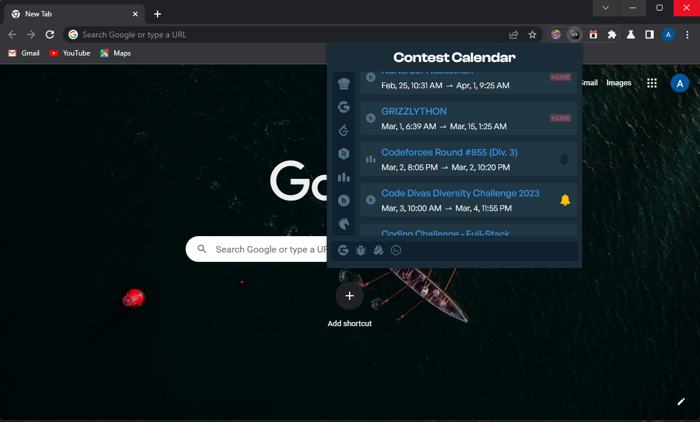

# Contest Calendar

Introducing the ultimate solution for every programming enthusiast out there! Say goodbye to the hassle of constantly surfing the web to find upcoming programming contests and hackathons. Contest Calendar, **an browser extension** is here to provide you with all the information you need in one place!

In a click of a button, you get access to a comprehensive list of upcoming programming contests and hackathons from all over the world. No more scouring the internet, wasting time and effort to find the perfect event. Now, save time and energy, and focus on what really matters: preparing for the challenge ahead.

We have a wide range of events from the most popular programming contest platforms like LeetCode, Google CodeJams, HackerEarth, and more! Whether you're interested in AI/ML, competitive programming, web development, or any other niche, we have something for you.

Contest Calendar allows you to quickly add an event to your Google Calendar, so no more worrying about missing registration deadlines.

## Screenshots

